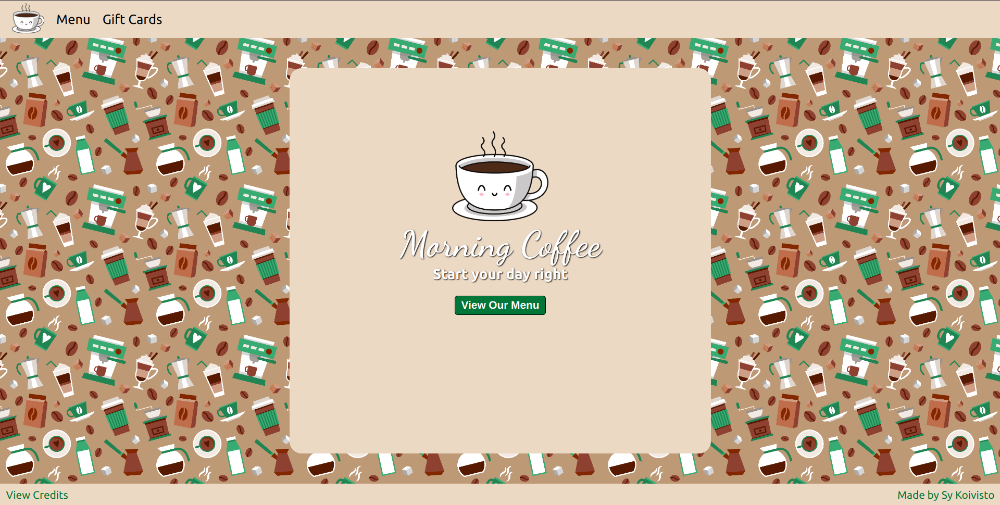

# Restaurant Page

## Description

This is a simple website for a coffee shop.
I built this website to practice using webpack for file and asset management. Webpack helps keep things clean and simple by allowing me to write each feature to a separate file before bundling them together. Clean files and an organized file tree is essential.

## Credits

This project was completed as a project for The Odin Project. Special thanks to the Webpack Guides.

[The Odin Project](https://www.theodinproject.com/)

[Webpack Guides](https://webpack.js.org/guides/getting-started/)

